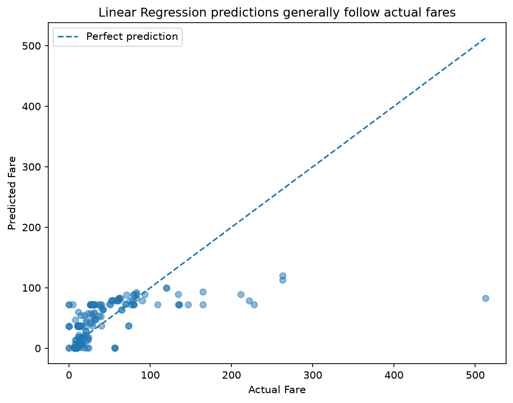
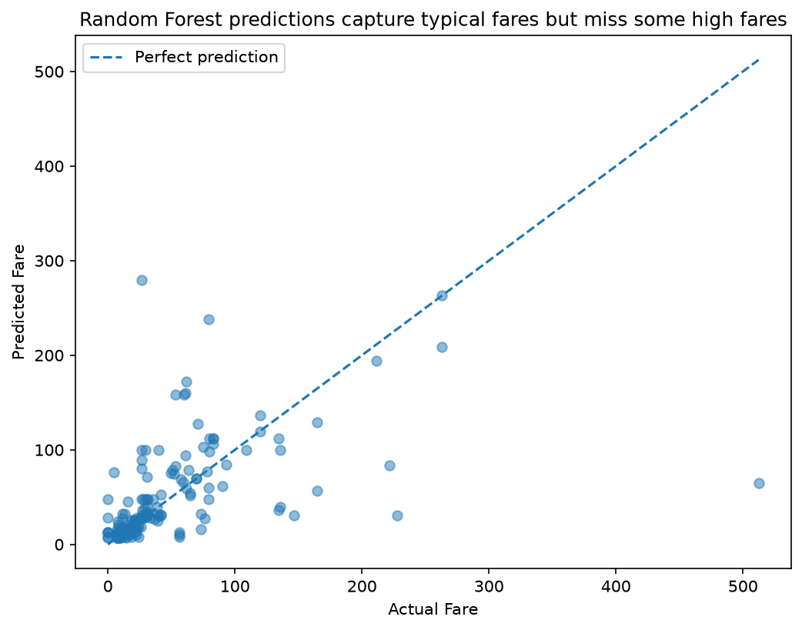

# Assignment 3 Report — Titanic Fare Prediction

## 1. Question Explored

This analysis explored whether passenger fare could be predicted using
passenger class (`pclass`), age (`age`), number of siblings/spouses aboard
(`sibsp`), and number of parents/children aboard (`parch`).

The target variable was `fare`.

Two regression models were trained and compared:
- Linear Regression
- Random Forest Regressor

## 2. Data Preparation

The cleaned and feature-engineered Titanic dataset from Assignment 2 was used
as the starting point. The selected features were numeric, so no categorical
encoding was required for this analysis.

The data was divided into 80% training data and 20% testing data. A
`random_state` of 42 was used to make the split reproducible.

## 3. Model Results

| Model | MAE | RMSE | R² |
|---|---:|---:|---:|
| Linear Regression | 21.77 | 40.93 | 0.369 |
| Random Forest | 16.33 | 43.98 | 0.272 |

Lower MAE and RMSE indicate smaller prediction errors, while a higher R²
indicates that the model explains more variation in the target.

## 4. Model Comparison

Linear Regression performed better overall based on RMSE and R². It achieved
an RMSE of 40.93 compared with 43.98 for Random Forest and an R² of 0.369
compared with 0.272.

However, Random Forest achieved a lower MAE of 16.33 compared with 21.77 for
Linear Regression. This means Random Forest had a smaller average absolute
error.

Overall, Linear Regression was considered the stronger model because it
performed better on two of the three evaluation metrics, particularly RMSE
and R².

## 5. Findings

The results suggest that the selected passenger characteristics provide some
ability to predict fare, but they do not explain all of the variation in
ticket prices.

The relatively low R² values also indicate that additional variables could
be useful for improving fare prediction.

## 6. Visualizations

### Linear Regression Predictions

### Random Forest Predictions

## 7. Limitation

One limitation is that only four features were used to predict fare. The
Titanic dataset contains other information that may contain useful signals,
and the models may perform differently if additional relevant features are
included.
## 8. Reflection

### What took the longest to get right?

The model comparison took the longest to understand because the two models did
not perform better on every metric. Random Forest had a lower MAE, while
Linear Regression had a lower RMSE and higher R². I had to understand what
each metric measures before deciding how to compare the models fairly.

### What would I do differently with another dataset?

With another dataset, I would spend more time selecting and engineering
features before training the models. I would also experiment with additional
models and compare their performance to see whether the prediction results
could be improved.