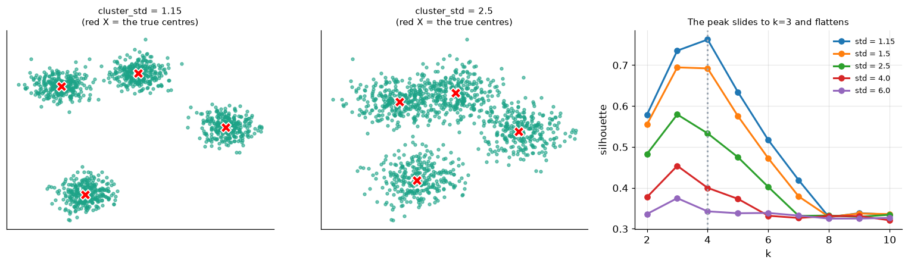
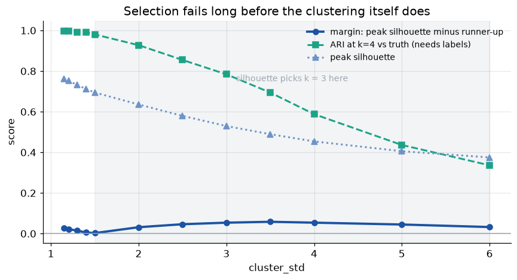
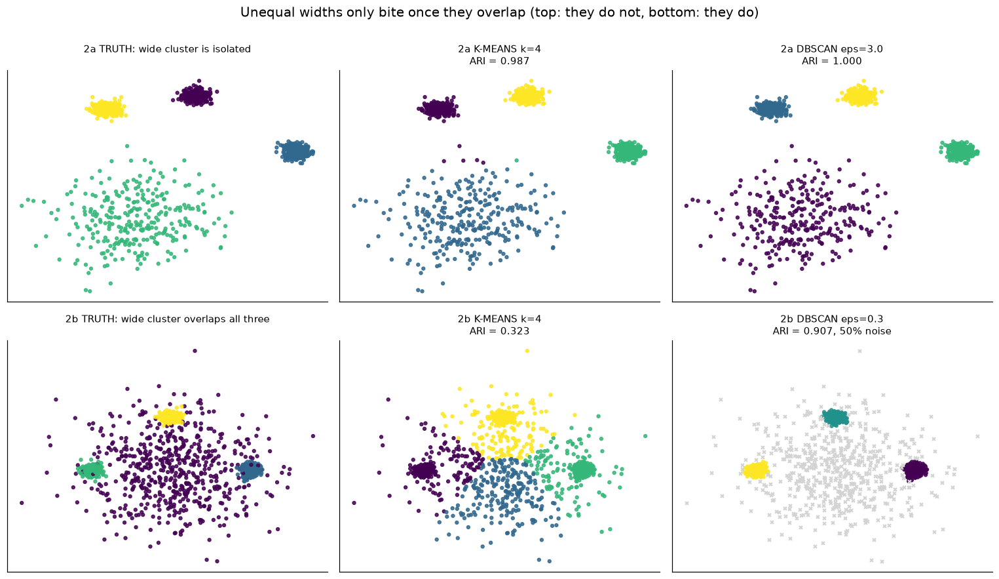
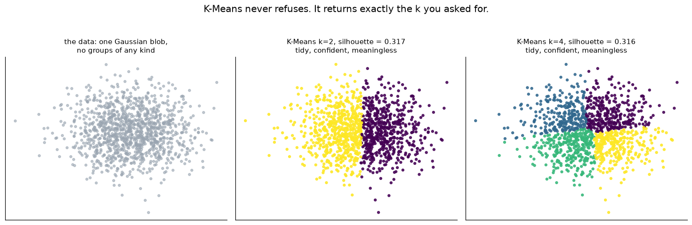
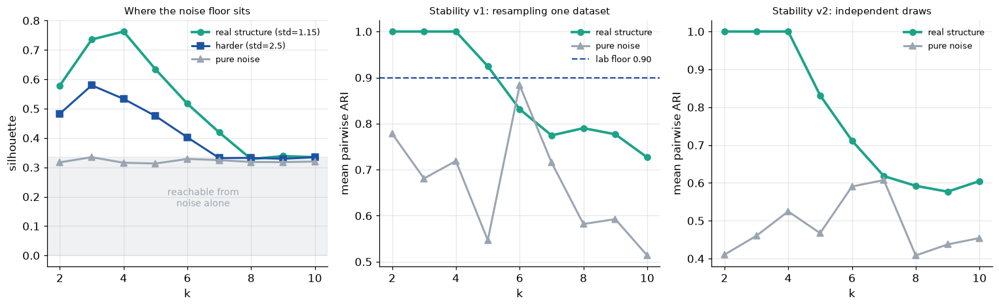
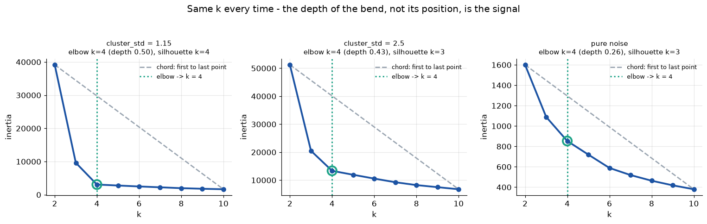
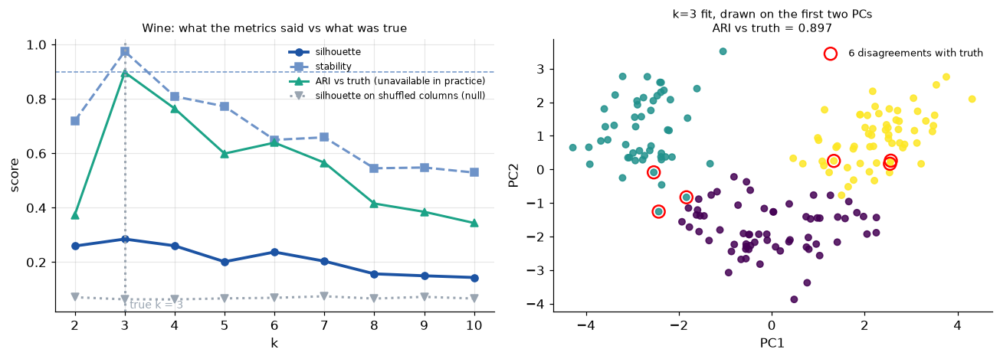

# Unsupervised Learning Report — Evaluating Clustering Without Labels

Assignment notebook: `notebooks/non-supervisedp.ipynb`
Source lab: `notebooks/Evaluating Unsupervised Models - Lab.ipynb`

## 1. Question Explored

Supervised learning tells you when you are wrong: you compare predictions against labels and
count mistakes. Unsupervised learning removes the answer key, so accuracy is unavailable —
yet a clustering model can still be too simple or too complicated.

This assignment asked a single question in five parts: **which diagnostics can still tell you
that a clustering is wrong, and when do those diagnostics themselves fail?**

Each part deliberately breaks something about the data and records which diagnostic notices
first.

| Part | What it breaks | Diagnostic under test |
|---|---|---|
| 1 | Clusters overlap (`cluster_std` increased) | Silhouette peak, and how sharp it is |
| 2 | Clusters have different widths | K-Means vs DBSCAN |
| 3 | There is no structure at all | Silhouette floor, stability |
| 4 | Reading the elbow by eye | An automatic elbow finder |
| 5 | Synthetic data | `choose_k` on a real dataset |

## 2. Data and Method

**Synthetic data (Parts 1–4).** `sklearn.datasets.make_blobs` with 1,200 points, 2 features
and 4 true centres. Synthetic data was used deliberately: because the correct answer is known
by construction, it is possible to show that a metric found the right answer rather than
merely a plausible one.

**Real data (Part 5).** The `load_wine` dataset — 178 samples, 13 features, standardised with
`StandardScaler`. Standardising matters because distance-based methods add up differences
across features, so a feature measured in hundreds would otherwise decide every cluster on
its own.

**Reproducibility.** `SEED = 42` throughout, with `n_init=10` on every K-Means fit so that a
single unlucky initialisation cannot drive a result.

**Metrics used.**

| Metric | Direction | Role |
|---|---|---|
| Inertia | Lower better, but always falls | Cannot select k; used only for the elbow |
| Silhouette | Higher better, has a real maximum | Selects k |
| Davies–Bouldin | Lower better, has a real minimum | Selects k (second opinion) |
| Stability (mean pairwise ARI) | Higher better, biased to small k | Filters k only |
| Adjusted Rand Index | Higher better | External check; needs labels |

Two helper functions from the lab were reused unchanged so that results stay comparable:
`stability` (bootstrap agreement) and `choose_k` (the filter-then-select checklist).

## 3. Part 1 — Making the Problem Harder

### What was done

The data was regenerated with `cluster_std=2.5` instead of `1.15` and the metric sweep rerun.
Because "stops recovering the truth" needs a definition, two quantities were tracked at every
setting: **which k the silhouette peak lands on**, and **the margin** — peak silhouette minus
the runner-up's, which measures how much the peak is actually worth as evidence.

The blob width was then scanned from 1.15 to 6.0 in fine steps.

### Results

| `cluster_std` | k chosen | Peak silhouette | Margin | ARI at k=4 |
|---|---:|---:|---:|---:|
| 1.15 | 4 | 0.763 | 0.027 | 0.998 |
| 1.30 | 4 | 0.732 | 0.014 | 0.991 |
| 1.40 | 4 | 0.712 | **0.006** | 0.991 |
| 1.50 | **3** | 0.695 | 0.003 | 0.980 |
| 2.50 | **3** | 0.579 | 0.046 | 0.855 |
| 4.00 | **3** | 0.454 | 0.054 | 0.588 |
| 6.00 | **3** | 0.375 | 0.032 | 0.336 |

### Findings

**Silhouette does not still peak at 4.** At `cluster_std=2.5` the peak moves to k=3 (0.579),
with the true k=4 second at 0.533.

**The peak flattens, and the flattening arrives before the error does.** At `std=1.4` the
margin has collapsed to 0.006 while the chosen k is *still correct*. That is the useful
warning: the peak is in the right place but is no longer distinguishable from its neighbour.
A flat peak means the data does not contain enough evidence to prefer one k over the next,
and the right response is to report a range — "k is 3 or 4, and the data cannot separate
them" — rather than a single number.

**A large margin is not evidence of correctness.** Past `std=1.5` the margin *grows back*
(0.031, 0.046, 0.054, 0.058) while pointing firmly at the wrong answer. The margin measures
how cleanly one partition beats another, not whether it is the true one. It is only
informative in the direction of doubt: a small margin reliably means "do not commit", while a
large one means nothing on its own.

**The method stops recovering the truth between `std=1.4` and `1.5`** — far earlier than the
brief's `2.5` suggests. But that threshold splits in two, and the gap between them is the most
practically important result in this part:

- **Selection** breaks at `std ≈ 1.5`, when the peak moves to k=3.
- **The clustering itself** survives much longer: ARI at k=4 is 0.980 at `std=1.5`, 0.855 at
  2.5, and only falls below 0.5 around `std=5`.

So across roughly `std` 1.5 to 4.0 there is a band where K-Means fitted at the correct k would
recover the structure well, but no internal metric will tell you that 4 was the correct k to
ask for.

**The specific wrong answer was predictable in advance.** An added cell measured the centre
geometry: clusters 0 and 3 sit 6.55 apart while every other pair is at least 10.03. That gap
is 5.7 standard deviations wide at `std=1.15` but only 4.4 at 1.5 and 2.6 at 2.5. The closest
pair merges first, leaving three visible groups — which is why the failure is specifically
k=3. The general lesson is to check how separated the clusters are *relative to their width*,
because that ratio, not the number of clusters, decides whether any of this works.

## 4. Part 2 — Clusters of Unequal Size

### What was done

`cluster_std` was given as a list, `[0.5, 0.5, 3.0, 0.5]`, producing one wide cluster and three
tight ones. K-Means at k=4 and a DBSCAN `eps` scan were both compared against the truth.

This did not break K-Means, so a second setting was added (see findings below) in which the
wide cluster genuinely overlaps its neighbours: the wide cluster (`std=3.5`) placed in the
middle holding 600 of the 1,200 points, with three tight clusters (`std=0.4`) at distance 6.
Explicit centre coordinates were used so that separation became a controlled quantity rather
than a property of the seed.

### Results

| Setting | K-Means ARI | Best DBSCAN ARI | What DBSCAN reported |
|---|---:|---:|---|
| 2a — brief's `[0.5, 0.5, 3.0, 0.5]` | 0.987 | 1.000 (`eps=3.0`) | 4 clusters, 0% noise |
| 2b — wide cluster overlapping | **0.323** | **0.907** (`eps=0.3`) | 3 clusters, 49.5% noise |

Cluster radii in setting 2b:

| | Values |
|---|---|
| Fitted K-Means radii | 1.48, 1.57, 1.57, 2.69 |
| True radii | 0.48, 0.48, 0.51, **4.34** |

### Findings

**The setting in the brief does not break K-Means.** It scored ARI 0.987, keeping 294 of the
wide cluster's 300 points in a single cluster. The reason is the geometry measured in Part 1 —
the closest two centres are 6.55 apart, so a cluster of width 3.0 still does not reach its
neighbours. **Unequal widths alone are not the problem; unequal widths *plus* overlap are.**
This is worth recording rather than glossing over, because an exercise that fails to fail is
easy to write up as a success.

**Once the overlap is real, K-Means fails hard.** In setting 2b it scored ARI 0.323 and split
the wide cluster across all four of its clusters (shares 0.19 / 0.39 / 0.19 / 0.23).

**Why it happens** is visible in the radii table above. K-Means minimises total *squared*
distance to centroids, and its decision boundaries are the Voronoi tessellation of those
centroids — so every cell is convex and they emerge at comparable radii. It compressed a
roughly tenfold spread of true radii into a 1.8-fold spread of fitted ones, because a cluster
4.34 wide beside clusters 0.5 wide is a shape it has **no parameters to represent**.

So it does the only thing available: the wide cluster is expensive in squared distance, so its
outskirts are handed to whichever tight centroid is nearest. Note the direction of the damage
— the tight clusters were not destroyed, they were **inflated with material taken from the
wide one**. Their fitted cells end up only 60–64% pure while still holding all 200 of their own
points. Anyone profiling those three segments would have been describing three clean groups
each diluted with about a third foreign material, with nothing in the output to indicate it.

**DBSCAN handles it better, but not in the way the question implies.** It scored 0.907 against
0.323 — but it reported **3 clusters and 49.5% of the data as noise**. It recovered the three
tight clusters and discarded most of the wide one. That is arguably a more honest description
of this data, since a diffuse background is not really a cluster, but it is not "found the four
groups", and only inspection would tell you which of those two things had happened.

**The answers differ because the two algorithms mean different things by "cluster".**

- **K-Means:** a cluster is a *region around a centroid*. Every point must join one, and
  density is not part of the model at all — so varying density is invisible to it, and its
  only possible response is to move boundaries.
- **DBSCAN:** a cluster is a *connected region of sufficient density*, and points in sparse
  regions are allowed to belong to nothing. Unequal width means unequal density, and only
  DBSCAN has any vocabulary for that.

**But DBSCAN's advantage is narrow and its failure is worse.** At `eps ≥ 1.0` it collapses to
a single cluster with ARI near zero (−0.056 to −0.002): the wide cluster is dense enough to act
as a bridge, so once `eps` spans its interior, single-linkage chaining welds all three tight
clusters into one blob. K-Means degrades gracefully; DBSCAN falls off a cliff. One *global*
`eps` also cannot serve two densities at once, which is precisely the limitation HDBSCAN exists
to remove.

**One caveat on the comparison.** `eps=0.3` was chosen by maximising ARI, which requires the
labels. Judging only from what is actually available — the clusters and noise% columns —
`eps=0.3` (3 clusters, 50% noise) does not obviously look better than `eps=0.7` (6 clusters,
15% noise), which scores 0.426. DBSCAN's win here is partly a win of hindsight.

## 5. Part 3 — When There Is No Structure At All

### What was done

The data was replaced with pure 2-D Gaussian noise, `rng.normal(size=(1200, 2))`, and the full
sweep rerun. This is the control experiment: any diagnostic that cannot distinguish this
dataset from four clean blobs is not a diagnostic.

Two extensions were added beyond the brief: the noise floor was measured across
dimensionalities and sample sizes, and the stability test was run in a second, stricter form.

### Results

| | Peak silhouette | Peak margin |
|---|---:|---:|
| Real structure (`std=1.15`) | 0.763 | 0.027 |
| Pure noise | **0.335** | **0.006** |

Noise floor by data shape:

| Dimensions (n=1200) | Noise floor | | Sample size (2-D) | Noise floor |
|---:|---:|---|---:|---:|
| 2 | 0.335 | | 100 | 0.380 |
| 5 | 0.145 | | 300 | 0.351 |
| 10 | 0.073 | | 1,200 | 0.335 |
| 20 | 0.039 | | 3,000 | 0.339 |
| 50 | 0.018 | | | |

Stability, both versions:

| k | v1 real | v1 noise | v2 real | v2 noise |
|---:|---:|---:|---:|---:|
| 2 | 1.000 | 0.778 | 1.000 | 0.410 |
| 3 | 1.000 | 0.681 | 1.000 | 0.460 |
| 4 | 1.000 | 0.719 | 1.000 | 0.525 |
| 6 | 0.831 | **0.883** | 0.712 | 0.590 |
| 10 | 0.727 | 0.514 | 0.605 | 0.454 |

### Findings

**The silhouette peak on pure noise is 0.335, at k=3.** K-Means partitioned structureless data
into three tidy, confident and entirely meaningless groups, with nothing in its output to
indicate a problem. K-Means never refuses; it returns exactly the k it was asked for.

**A fixed height threshold does not work.** The 2.28× ratio between 0.763 and 0.335 looks
encouraging, but 0.335 is not a low number by the standards of real results — wine, in Part 5,
has genuine structure and reaches only 0.285. A threshold set from this comparison would
reject wine. Two better signals emerged:

1. **The margin, not the height.** The noise curve is flat: 0.313 to 0.335 across the whole
   range k=2…10, and its "peak" beats the runner-up by 0.006. There is no peak there, only
   sampling wobble in the third decimal.
2. **A calibrated floor rather than a remembered one.** The floor is not a constant — it moved
   eighteenfold across dimensionality alone. A 0.335 rule learned in 2-D is wrong in **both**
   directions: in 50-D it would reject a silhouette of 0.15 that sits more than 8× above that
   data's own floor. Smaller samples also reach *higher* noise silhouettes (0.380 at n=100), so
   small-n findings need a higher bar, not the same one.

So the threshold is not a number but a procedure: **destroy the structure in your own data and
rerun the sweep.** Shuffling each column independently is the right null — it preserves every
feature's own distribution and removes only the relationships *between* features, which is
where cluster structure lives. Part 5 applies exactly this to wine.

**On the stability test, the two versions disagree in an instructive way.**

*Version 1 — resampling one dataset* (the lab's `stability`) separates real from noise, but
less cleanly than expected: noise scored **0.883 at k=6, higher than real structure at k=6
(0.831)**. The lab's 0.90 floor holds on both, but not by much. The reason is structural —
every subsample of one noise dataset inherits that dataset's accidental elongations, so the
partitions genuinely agree with each other about an artefact. **Reproducibility within one
sample is not the same as reality.**

*Version 2 — independent draws from the same source* (centres held fixed, only the points
redrawn) is the stricter test and separates cleanly: real data 1.000 at k=2, 3 and 4 decaying
to 0.605, while noise never exceeds 0.607.

**Version 2 also makes the bias unmistakable.** Real data scores a perfect 1.000 at k=2, k=3
*and* k=4 — a three-way tie. Splitting four well-separated blobs into two groups is perfectly
reproducible too, so a high stability score cannot distinguish "correct" from "correct but
coarser". **Stability filters; it never selects.** Use it to eliminate, then let a metric with
a real maximum choose among the survivors — which is what `choose_k` does in Part 5, and there
it turns out to be the diagnostic carrying the whole decision.

## 6. Part 4 — Finding the Elbow Honestly

### What was done

A function `elbow_k` was written to locate the elbow automatically as the point on the inertia
curve lying furthest from the straight chord joining the curve's first and last points.

One detail not mentioned in the brief but decisive in practice: **both axes must be rescaled
first.** `k` runs 2 to 10 while inertia runs into the tens of thousands, so in raw units the
perpendicular distance to the chord is essentially the vertical distance to it and the "elbow"
partly reflects the units. The function maps both axes to [0, 1] before measuring, and returns
the per-k distances alongside the choice so the depth of the bend is available too. Both the
normalised and raw versions are computed in the notebook so the difference is visible rather
than asserted.

### Results

| Dataset | Elbow k | Bend depth | Silhouette k |
|---|---:|---:|---:|
| `std = 1.15` | 4 | 0.504 | 4 |
| `std = 1.5` | 4 | 0.486 | 3 |
| `std = 2.5` | 4 | 0.426 | 3 |
| `std = 4.0` | 4 | 0.344 | 3 |
| `std = 6.0` | 4 | 0.290 | 3 |
| **Pure noise** | **4** | 0.256 | 3 |
| Wine (Part 5) | 4 | 0.244 | 3 (true k = 3) |

### Findings

**It agrees with the silhouette peak on the baseline data** — k=4 on `cluster_std=1.15`,
matching both the silhouette peak and the truth. The normalised and raw versions happen to
agree here, though normalising remains the correct default.

**It does not still agree on the harder data, and the reason is worse than disagreement. The
elbow returns k=4 on every single dataset, including pure noise with no structure whatsoever.**
It agreed with the truth once, at `std=1.15`, by coincidence; on wine it says 4 when the answer
is 3. A function that answers "4" regardless of the question is not measuring the question.

The explanation: inertia falls smoothly and convexly whether or not clusters exist. The
chord-distance construction is a **curvature detector**, and the position of maximum curvature
on a smooth convex decay is set by the shape of that decay and the k-range swept — not by how
many groups are in the data. This is the lab's own thesis reasserting itself one level up.
Inertia always falls, so it cannot choose k; **automating the reading of the elbow does not
repair that, it hides it behind a function call.**

**What does carry information is the depth of the bend** — the maximum perpendicular distance
itself. It falls monotonically as the structure dissolves (0.504, 0.486, 0.426, 0.344, 0.290)
and reaches 0.256 on noise: a 1.97× separation between real structure and none. That is a
usable *strength* signal, on the same footing as the silhouette height in Part 3 and subject to
the same requirement — compare it against a shuffled null for your own dataset rather than a
memorised constant. It is a weaker separator than silhouette's 2.28× and its dynamic range is
narrow.

**Practical conclusion:** the elbow is a free sanity check to run alongside a real selector,
and a reasonable tie-breaker when silhouette and Davies–Bouldin disagree. It should never get
a vote of its own. If it is the only diagnostic in use, there is no diagnostic — only a
function that says 4.

## 7. Part 5 — Real Data

### What was done

`load_wine` was standardised and passed to `choose_k`, the lab's checklist function, unchanged.
An answer was committed from the metrics alone before the label vector was opened, and a null
model (each column shuffled independently) was run as a pre-registered check.

### Committed answer, before looking: k = 3

The stability filter was decisive on its own — only k=3 cleared the 0.90 floor (**0.975**, with
the next best k=4 at 0.809), reducing the field to a single candidate before either selector
spoke. Both selectors then agreed independently: silhouette peaked at 3 (0.285) and
Davies–Bouldin bottomed at 3 (1.389).

Null check: **0.285 against 0.075** on column-shuffled data, a ratio of 3.82×. The structure
clears its own null convincingly, even though 0.285 would look weak measured against the
synthetic blobs' 0.763.

### Results, after opening the envelope

True number of classes: **3**, with sizes [59, 71, 48].

| k | Silhouette | Davies–Bouldin | Stability | ARI vs truth |
|---:|---:|---:|---:|---:|
| 2 | 0.259 | 1.526 | 0.719 | 0.374 |
| **3** | **0.285** | **1.389** | **0.975** | **0.897** |
| 4 | 0.260 | 1.797 | 0.809 | 0.765 |
| 6 | 0.237 | 1.554 | 0.649 | 0.639 |
| 10 | 0.144 | 1.707 | 0.529 | 0.344 |

### Findings

**The committed answer was correct.** All three internal diagnostics and the external ARI peak
at the same k, and the k=3 fit scores ARI 0.897 — 6 points misassigned out of 178, shown as the
red rings in the right-hand panel.

**Which diagnostic would have warned me?** None needed to, but the question is still worth
answering, because two things could easily have gone wrong:

- **The elbow said k=4.** Used as the selector it would have committed me to 4 and been wrong,
  scoring ARI 0.765 instead of 0.897 — exactly as Part 4 predicted.
- **Stability was load-bearing, and silhouette nearly failed.** The silhouette gap between k=3
  (0.285) and k=4 (0.260) is 0.025 — by Part 1's standard a thin margin, in the range where I
  argued you should refuse to commit. On silhouette alone this was close to a coin toss.
  Stability broke the tie decisively at 0.975 against 0.809.

That last point appears to contradict the lab's warning that stability is biased towards small
k and should filter rather than select, and it does not — which is worth stating precisely.
Stability earned its keep here through its **low** values, eliminating k=2 (0.719) and
everything from k=4 upward. It was never asked to point at a maximum. And it did not simply
prefer the smallest k available: **k=2 failed the filter**, because a two-way split of three
overlapping classes is not reproducible either. The bias is real but it is not unconditional.

**One further observation.** Wine's peak silhouette of 0.285 is less than half the synthetic
data's 0.763, yet the answer is right with ARI 0.897. Real classes overlap; that is what real
data looks like. **Absolute silhouette values are not comparable across datasets.** Only
comparisons *within* a dataset mean anything — across k, and against that dataset's own
shuffled null.

## 8. Deviations From the Brief

Four places where the assignment as written did not survive contact with the data, and what
was done instead. These are recorded because in each case the deviation is the finding.

| # | Issue | What was done |
|---|---|---|
| 1 | Part 2's suggested `cluster_std=[0.5, 0.5, 3.0, 0.5]` does not break K-Means (ARI 0.987) — with `random_state=42` the centres are too far apart for width 3.0 to reach anything | Kept setting 2a and reported the negative result, then added setting 2b with explicit centres where the wide cluster genuinely overlaps. Both are shown |
| 2 | The brief's elbow specification omits axis rescaling, which changes the answer | Implemented with a `normalise` flag and reported both versions |
| 3 | The elbow returns k=4 on every dataset including noise, so its position carries no information | Added the bend depth (max chord distance) as the quantity that does |
| 4 | The lab's `stability` resamples one dataset, which can be fooled by that sample's accidents | Added a second version comparing models fit on independent draws, with the blob centres held fixed |

On item 4, an error in my own first attempt is worth recording. The initial sampler called
`make_blobs` with a fresh `random_state` per draw, which re-randomises the **centre locations**
as well as the points — so it was comparing different sources rather than different samples
from one source. It reported real blobs as *less* stable than noise — around 0.09 against 0.37
at k=2 — which is backwards. (Those figures come from the discarded version and are not
reproducible from the notebook, which contains only the corrected function.) Holding the
centres fixed and redrawing only the points gives the correct result: 1.000 for real structure
against no more than 0.607 for noise.

The lesson: when building a null or a resampling test, be explicit about which part of the
data-generating process is held fixed and which is allowed to vary. Here the sampler was
varying the thing the test was supposed to be measuring.

## 9. Limitations

- **Parts 1–4 use synthetic 2-D Gaussian blobs.** This was the right choice for demonstrating
  that a metric finds a known answer, but Gaussian blobs are the case K-Means is built for.
  Non-convex shapes (concentric circles, crescents) would fail K-Means at *every* k, which
  none of these experiments tests.
- **Only one real dataset.** Wine is small (178 rows), clean, and has fairly well-separated
  classes. One dataset where `choose_k` succeeds is not evidence about how often it succeeds.
- **Every conclusion is at `SEED=42`.** Part 2 shows how much a seed can matter — the brief's
  setting failed to break K-Means purely because of where seed 42 placed the centres. The
  scans vary the parameter of interest but not the seed, so a repeat across seeds with
  confidence intervals would be a stronger design.
- **DBSCAN's `eps` was tuned against the labels**, which is not possible in practice. The
  reported 0.907 is therefore an upper bound on what DBSCAN would achieve unsupervised.
- **`min_samples=8` was held fixed** throughout the DBSCAN scans. It is a second complexity
  dial and was not explored.
- **The claim that the elbow position is an artefact of the swept k-range** is supported by six
  datasets all returning 4, but the k-range itself was not varied to confirm the mechanism
  directly.

## 10. Findings Summary

| Part | Question | Answer |
|---|---|---|
| 1 | Does silhouette still peak at 4 at `std=2.5`? | No — k=3, with k=4 second |
| 1 | Where does it break? | Between `std` 1.4 and 1.5, but the margin collapses to 0.006 at 1.4 while the answer is still right |
| 1 | What does a flat peak mean? | Not enough evidence to prefer one k — report a range. A *large* margin means nothing: it returns to 0.058 while pointing at the wrong k |
| 2 | What does K-Means do to the wide cluster? | Nothing in the brief's setting (ARI 0.987). Once it overlaps: quarters it across all four clusters (ARI 0.323) and inflates the tight clusters to 60–64% purity |
| 2 | Does DBSCAN handle it better? | Yes, 0.907 vs 0.323 — but by calling 49.5% of the data noise, and it collapses to one cluster (ARI ≈ 0) once `eps` bridges the wide cluster |
| 3 | Silhouette peak on pure noise? | 0.335 at k=3, margin 0.006, curve flat from 0.313 to 0.335 |
| 3 | Where is the threshold? | Not a number. The floor runs 0.335 (2-D) to 0.018 (50-D) and is higher for small n. Shuffle your own columns and use what you get |
| 3 | What does stability say? | Resampling one dataset is partly fooled (noise 0.883 at k=6 beats real 0.831). Independent draws separate cleanly: real 1.000, noise never above 0.607 |
| 4 | Does the elbow agree with silhouette? | Only on the easy data. It returns k=4 on all six datasets, including pure noise |
| 4 | Is it usable at all? | Its position, no. Its bend depth, yes: 0.504 real vs 0.256 noise |
| 5 | `choose_k` on wine? | k=3 — correct. ARI 0.897, and 0.285 vs 0.075 against its own shuffled null |
| 5 | Which diagnostic mattered? | Stability (0.975 vs 0.809). Silhouette's margin was only 0.025. The elbow said 4 and would have been wrong |

### What this adds to the lab

The lab's closing claim was that *a metric which improves every time you add complexity cannot
be used to choose complexity* — inertia and reconstruction error fail that test, while
silhouette, held-out likelihood, BIC and stability pass it.

What these five exercises add is that **passing that test is necessary but not sufficient.**
Every surviving metric still fails quietly, and each has a specific tell:

- **Silhouette** — the *margin*, not the height, says whether the peak is a decision. It went
  flat one step before it went wrong, and its confidence returned while pointing at the wrong
  answer.
- **Every threshold is dataset-specific.** The noise floor moved eighteenfold across
  dimensionality alone. Calibrate against a shuffled null; never carry a remembered number
  between datasets.
- **Stability filters, it never selects** — it tied across k=2, 3 and 4 on clean data. And
  resampling one dataset is strictly weaker than redrawing from the source, because every
  subsample inherits the same accidents.
- **The elbow is a curvature detector, not a cluster detector.** It answered "4" to every
  question asked of it, noise included.
- **Selection breaks long before clustering does.** Across `std` 1.5 to 4.0, K-Means at k=4
  recovers the structure well (ARI 0.98 down to 0.59) while no internal metric will confirm
  that 4 was right to ask for. These are two separate failures and deserve separate reporting.
- **The algorithm's assumptions decide the failure mode.** K-Means cannot represent unequal
  radii and responds by moving boundaries and silently contaminating good clusters; DBSCAN can,
  and responds by discarding half the data or welding everything into one. Neither is a bug —
  both are the model class showing through.

The practical habit all six point at: **never report one number, from one metric, on one
sample.** Report the range the metrics allow, the null you compared against, and which
diagnostic actually decided it.

## 11. Reflection

### What took the longest to get right?

Part 2, because the exercise initially appeared to succeed. K-Means scored ARI 0.987 on the
`[0.5, 0.5, 3.0, 0.5]` data, which I could have written up as "K-Means handles unequal cluster
sizes well" and moved on. Working out *why* it had not failed — that the centres were 6.55
apart so a width-3.0 cluster never actually reaches its neighbours — took longer than running
any of the experiments, and it changed the conclusion completely. Unequal width is not the
problem; unequal width combined with overlap is. I had to build a second dataset with
controlled centre positions before the effect the exercise was asking about existed at all.

The stability test in Part 3 was the other slow part, and there I got it wrong first. My
initial version drew fresh `make_blobs` samples with a new `random_state` each time, which
moves the cluster centres as well as resampling the points. It reported that real clusters were
*less* reproducible than pure noise, which was obviously backwards and sent me looking for the
cause in the metric before I found it in my own sampler.

### What surprised me most?

That the elbow finder returns k=4 on pure noise. I expected it to be imprecise, not
uninformative. Seeing it give the same answer on four clean blobs and on 1,200 points of
structureless Gaussian noise made the lab's central point land much harder than reading it did:
inertia always falls, and automating how you read a curve that always falls does not fix
anything.

The second surprise was how early selection breaks in Part 1 compared with the clustering
itself. There is a wide band of `cluster_std` where fitting K-Means at k=4 recovers the truth
almost perfectly, but no internal metric will tell you that 4 was the number to use. Before
this I had implicitly assumed those two failures arrived together.

### What would I do differently with another dataset?

I would build the null model first, before looking at any score. In Part 3 the threshold
question had no fixed answer, and the only defensible procedure was to shuffle the data's own
columns and see what silhouette a structureless version of *that specific dataset* could reach.
On wine, that null (0.075 against 0.285) was more convincing than the raw score, which looked
weak next to the synthetic 0.763. Running the null first would stop me anchoring on a number
from a different dataset.

I would also repeat the key scans across several seeds rather than one. Part 2 showed how much
a single seed can decide, and every conclusion here rests on `SEED=42`.

Finally, I would test a non-convex dataset — concentric circles or crescents. Everything here
used Gaussian blobs, which is the shape K-Means is designed for, so these experiments only
measured how it handles the *number* and *width* of clusters, never a shape it cannot represent
at any k.
